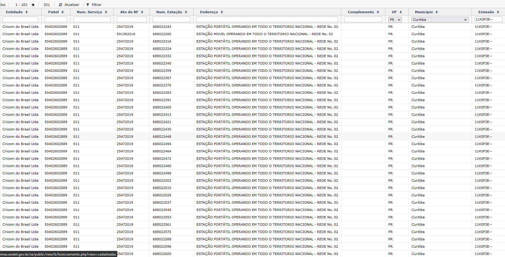
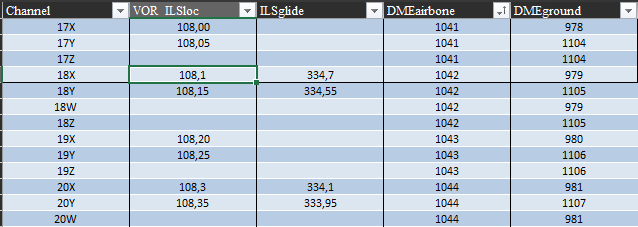

<!-- WARNING: THIS FILE WAS AUTOGENERATED! DO NOT EDIT! -->

## RFDataHub

> A presente biblioteca tem como intuito agregar dados de estações
> transmissoras de Radiofrequência

- O fluxo é concentrado nos dados licenciados junto à ANATEL de serviços
  públicos de Radiodifusão e Serviços Privados de Telecomunicações, além
  de dados de emissores aeronáuticos consumidos de diversas APIs e
  fontes documentais institucionais.

- Os diversos módulos presentes fazem a extração, limpeza,
  pós-processamento, validação, verificação de qualidade e agregação
  desses dados num formato consolidado para os planos de monitoração da
  ANATEL.

## BASES DE DADOS

> A Seguir são descritas as instâncias de banco, as bases de dados e as
> tabelas consultadas.

- Instância de Banco de Dados SQL - Server - `ANATELBDRO05`:
  - Base de Dados: `SITARWEB`:
    - `STEL` - Serviços Privados de Telecomunicações  
      Base legada cujos registros, novos e antigos, estão sendo
      transferidos para o banco de dados `licenciamento` da instância
      `ANATELBDRO06`
  - Base de Dados: `SRD`:
    - `RADCOM` - Serviço de Radiodifusão Comunitária
- Instância de Banco de Dados MongoDB - `ANATELBDRO06`:
  - Base de Dados: `sms`
    - Coleção: `srd`:
      - `SRD` - Demais serviços de Radiodifusão, e.g. TV, RTV, RTVD, FM,
        AM, etc.
    - Coleção: `licenciamento`:
      - `TELECOM` - Serviços Privados de Telecomunicações, e.g. Limitado
        Privado.
      - `SMP` - Serviço Móvel Pessoal, e.g. 4G e 5G

  > A base de dados `sms`, e no geral a instância como um todo, é
  > referida como `MOSAICO` por conta da plataforma web no qual são
  > servidos esses dados para acesso.
- `AERONAUTICA` - Consolidação de diversas bases de dados públicas da
  aeronáutica. Esses dados são enriquecidos com informações adicionais
  fornecidas por órgãos como o DECEA, além de emissões conhecidas
  provenientes de conhecimento técnico prévio consolidado na agência.

## RADCOM

<details>
<summary>Code</summary>

``` python
pasta = Path.cwd().parent / 'dados'
df = pd.read_parquet(pasta / 'radcom.parquet.gzip')
df.sample(5).iloc[:, :6]
```

</details>
<div>
<style scoped>
    .dataframe tbody tr th:only-of-type {
        vertical-align: middle;
    }

    .dataframe tbody tr th {
        vertical-align: top;
    }

    .dataframe thead th {
        text-align: right;
    }
</style>
<table border="1" class="dataframe">
  <thead>
    <tr style="text-align: right;">
      <th></th>
      <th>Frequência</th>
      <th>Entidade</th>
      <th>Fistel</th>
      <th>Estação</th>
      <th>Município</th>
      <th>Código_Município</th>
    </tr>
  </thead>
  <tbody>
    <tr>
      <th>3168</th>
      <td>104.9</td>
      <td>ASSOCIACAO COMUNITARIA JOAIMENSE CULTURAL DE R...</td>
      <td>50012640301</td>
      <td>682812145</td>
      <td>Joaíma</td>
      <td>3136009</td>
    </tr>
    <tr>
      <th>3345</th>
      <td>104.9</td>
      <td>ASSOCIACAO DE AMIGOS VALE DO GUAPORE</td>
      <td>50013713175</td>
      <td>683836722</td>
      <td>Pontes e Lacerda</td>
      <td>5106752</td>
    </tr>
    <tr>
      <th>4433</th>
      <td>105.9</td>
      <td>ASSOCIACAO COMUNITARIA DE APOIO A CIDADANIA-ACAC</td>
      <td>50013423096</td>
      <td>683549529</td>
      <td>Guarará</td>
      <td>3128501</td>
    </tr>
    <tr>
      <th>3169</th>
      <td>104.9</td>
      <td>ASSOCIAÇÃO COMUNITÁRIA EDUCATIVA DE JURAMENTO ...</td>
      <td>50409156329</td>
      <td>699282721</td>
      <td>Juramento</td>
      <td>3136801</td>
    </tr>
    <tr>
      <th>457</th>
      <td>87.9</td>
      <td>ASSOCIAÇÃO COMUNITÁRIA E DE COMUNICAÇÃO SOCIAL...</td>
      <td>50409272230</td>
      <td>697612040</td>
      <td>Salitre</td>
      <td>2311959</td>
    </tr>
  </tbody>
</table>
</div>

### Filtragem ✂️

Os únicos filtros efetuados na *query* para os dados de RADCOM são:

``` sql
<...>
where
    SRD.IdtPlanoBasico is not Null 
    and SRD.IndFase is not Null
<...>
```

Esse filtro significa que a emissão está licenciada devidamente com o
processo de outorga já concluído ou com funcionamento autorizado.

<details>
<summary>Code</summary>

``` python
print(f'A base RADCOM possui atualmente {len(df)} registros ativos.')
```

</details>

    A base RADCOM possui atualmente 4996 registros ativos.

### Descrição 📊

A seguir são descritas as colunas extraídas da base e o significado de
cada uma

- `Frequência`: Frequência de Transmissão da Estação
- `Entidade`: Nome da Pessoa (Física \| Jurídica) detentora da Outorga
- `Fistel`: Código itentificador da Outorga de Serviço, um Fistel pode
  conter uma ou mais estações
- `Estação`: Código Identificador da Estação - Código não
  necessáriamente único, por vezes uma única estação possui diversos
  transmissores com características distintas
- `Município`: Município de Outorga daquela estação
- `Código_Município`: Código único do IBGE identificando univocamente o
  município, esse código é utilizado para validar a localização das
  coordenadas da estação
- `UF`: Unidade Federativa ( Estado )
- `Latitude`: Latitude em formato Decimal
- `Longitude`: Longitude em formato Decimal
- `Fase`: Fase do Processo de Licenciamento
- `Situação`: Situação da Outorga

### Pós-Processamento 🛠️

A seguir são descritas as colunas adicionadas à base extraída e o
significado de cada uma

> As colunas `Fase` e `Situação` somente existem na base `RADCOM`, para
> normalizar esses dados e combinar com as demais bases, essas duas
> colunas são transformadas em uma única coluna chamada `Classe`, essa
> coluna tem o intuito em todas as tabelas de identificar o tipo de
> estação transmissora:

- Onde a informação de `Situação` é ausente, a `Classe` é igual a
  `Fase`, exemplos:
  - `3`
  - `P`
- Onde ambas estão presentes a `Classe` é igual a `<Fase>-<Situação>`:
  - `3-P`
  - `P-A`
- `Serviço`: Número identificador do serviço, no caso de `RADCOM` o
  valor é único: `231`
- `Classe_Emissão`: Dado ausente na base de `RADCOM` , inserido valores
  únicos nulos para normalizar com as demais bases
- `Largura_Emissão(kHz)`: Largura de Banda da Emissão em kHz. Nessa
  coluna é imputado o valor de `256`, valor padrão para o serviço FM.
- `Validade_RF`: Dado ausente na base de `RADCOM` , inserido valores
  únicos nulos para normalizar com as demais bases
- `Status`: Dado ausente na base de `RADCOM` , inserido valor único
  `RADCOM` para normalizar com demais bases
- `Fonte`: Fonte dos dados, nessa caso é inserido o nome da Tabela:
  `SRD`
- `Multiplicidade`: Contagem do Registro. Nesse caso o valor é somente
  `1` por conta de todos os registros serem únicos, i.e. são referentes
  a uma estação única

### Dados Incorretos 🗑️

A seguir são exibidas informações sobre coordenadas ausentes ou
facilmente identificadas como incorretas, nesse caso fora dos limites do
Brasil. \> Uma validação precisa das coordenadas é feita antes de
consolidar o arquivo final e será descrita posteriormente

<details>
<summary>Code</summary>

``` python
print(f'Número de coordenadas ausentes: {df[df.Latitude.isna() | df.Longitude.isna()].shape[0]}')
```

</details>

    Número de coordenadas ausentes: 0

<details>
<summary>Code</summary>

``` python
df[['Latitude', 'Longitude']] = df[['Latitude', 'Longitude']].astype('float')
bad = df[~(df.Latitude.between(MIN_LAT, MAX_LAT) & df.Longitude.between(MIN_LONG, MAX_LONG))]
print("Exemplo de coordenadas incorretas, fora dos limites do Brasil: ")
bad.loc[:, ['Frequência', 'Entidade', 'Estação', 'Município', 'Latitude', 'Longitude']]
```

</details>

    Exemplo de coordenadas incorretas, fora dos limites do Brasil: 

<div>
<style scoped>
    .dataframe tbody tr th:only-of-type {
        vertical-align: middle;
    }

    .dataframe tbody tr th {
        vertical-align: top;
    }

    .dataframe thead th {
        text-align: right;
    }
</style>
<table border="1" class="dataframe">
  <thead>
    <tr style="text-align: right;">
      <th></th>
      <th>Frequência</th>
      <th>Entidade</th>
      <th>Estação</th>
      <th>Município</th>
      <th>Latitude</th>
      <th>Longitude</th>
    </tr>
  </thead>
  <tbody>
    <tr>
      <th>64</th>
      <td>87.5</td>
      <td>ASSOCIAÇÃO SERRANA COMUNITÁRIA - ASERCOM</td>
      <td>691861544</td>
      <td>São Francisco de Paula</td>
      <td>-50.572500</td>
      <td>-29.446389</td>
    </tr>
    <tr>
      <th>327</th>
      <td>87.9</td>
      <td>Associação de Radiodifusão Comunitária de Ipec...</td>
      <td>1010974570</td>
      <td>Ipecaetá</td>
      <td>-0.205286</td>
      <td>-0.655050</td>
    </tr>
    <tr>
      <th>470</th>
      <td>87.9</td>
      <td>ASSOCIAÇÃO COMUNITÁRIA E CULTURAL DE BOA ESPER...</td>
      <td>695516850</td>
      <td>Boa Esperança</td>
      <td>-36.535556</td>
      <td>-79.833889</td>
    </tr>
    <tr>
      <th>482</th>
      <td>87.9</td>
      <td>Associação Rural Jaguarense</td>
      <td>1015029458</td>
      <td>Jaguaré</td>
      <td>-0.313650</td>
      <td>-0.669211</td>
    </tr>
    <tr>
      <th>638</th>
      <td>87.9</td>
      <td>ASSOCIAÇÃO COMUNITÁRIA DE SÃO LUIZ DO NORTE</td>
      <td>695284665</td>
      <td>São Luiz do Norte</td>
      <td>-36.042222</td>
      <td>-68.627222</td>
    </tr>
    <tr>
      <th>736</th>
      <td>87.9</td>
      <td>ASSOCIAÇÃO COMUNITÁRIA VOZ DE SÃO PEDRO DOS CR...</td>
      <td>691975078</td>
      <td>São Pedro dos Crentes</td>
      <td>-3.501111</td>
      <td>-0.773333</td>
    </tr>
    <tr>
      <th>1072</th>
      <td>87.9</td>
      <td>ASSOCIAÇÃO DOS AMIGOS DA CULTURA</td>
      <td>691081085</td>
      <td>Poços de Caldas</td>
      <td>-45.838889</td>
      <td>-21.923611</td>
    </tr>
    <tr>
      <th>1267</th>
      <td>87.9</td>
      <td>ASSOCIAÇÃO COMUNITÁRIA IPIRANGUENSE</td>
      <td>1014626029</td>
      <td>Ipiranga do Norte</td>
      <td>-0.203989</td>
      <td>-0.935672</td>
    </tr>
    <tr>
      <th>1330</th>
      <td>87.9</td>
      <td>FUNDAÇÃO DE ASSISTÊNCIA À FAMÍLIA ANTÔNIO CORR...</td>
      <td>695446541</td>
      <td>Irituia</td>
      <td>-1.771389</td>
      <td>-4.437222</td>
    </tr>
    <tr>
      <th>1406</th>
      <td>87.9</td>
      <td>CENTRO INTEGRADO DE AÇÕES COMUNITÁRIAS PELA VIDA</td>
      <td>1015253617</td>
      <td>João Pessoa</td>
      <td>-0.119872</td>
      <td>-0.580836</td>
    </tr>
    <tr>
      <th>1703</th>
      <td>87.9</td>
      <td>Associação Comunitária de Tamoios</td>
      <td>1014984820</td>
      <td>Cabo Frio</td>
      <td>-0.376531</td>
      <td>-0.700028</td>
    </tr>
    <tr>
      <th>2103</th>
      <td>87.9</td>
      <td>ASSOCIAÇÃO DE MÍDIA COMUNITÁRIA DA CIDADE DE N...</td>
      <td>1009018300</td>
      <td>Nhandeara</td>
      <td>-20.694167</td>
      <td>-5.041111</td>
    </tr>
    <tr>
      <th>2384</th>
      <td>98.5</td>
      <td>ASSOCIAÇÃO DE RÁDIO E CULTURA</td>
      <td>691860033</td>
      <td>Serra</td>
      <td>-52.223611</td>
      <td>-40.211389</td>
    </tr>
    <tr>
      <th>2441</th>
      <td>98.7</td>
      <td>INSTITUTO DE RADIODIFUSÃO E DESENVOLVIMENTO CO...</td>
      <td>1014997094</td>
      <td>Sobral</td>
      <td>-0.067903</td>
      <td>-0.665706</td>
    </tr>
    <tr>
      <th>2442</th>
      <td>98.7</td>
      <td>Centro Cultural de Comunicação de Jaibaras - CCCJ</td>
      <td>1014529902</td>
      <td>Sobral</td>
      <td>-0.062869</td>
      <td>-0.674886</td>
    </tr>
    <tr>
      <th>2619</th>
      <td>104.9</td>
      <td>ASSOCIAÇÃO SEMEANDO PARA O FUTURO</td>
      <td>1014898444</td>
      <td>Belmonte</td>
      <td>-0.264261</td>
      <td>-0.647931</td>
    </tr>
    <tr>
      <th>2934</th>
      <td>104.9</td>
      <td>ASSOCIAÇÃO DE RADIODIFUSÃO COMUNITÁRIA DE NENE...</td>
      <td>1015020108</td>
      <td>Quixeramobim</td>
      <td>5.441389</td>
      <td>-39.197500</td>
    </tr>
    <tr>
      <th>3145</th>
      <td>104.9</td>
      <td>ASSOCIAÇÃO COMUNITÁRIA AMIGOS DE GUIDOVAL</td>
      <td>1015168172</td>
      <td>Guidoval</td>
      <td>-0.352519</td>
      <td>-0.713217</td>
    </tr>
    <tr>
      <th>3329</th>
      <td>104.9</td>
      <td>ASSOCIAÇÃO COMUNITÁRIA E CULTURAL DE CONQUISTA...</td>
      <td>699394678</td>
      <td>Conquista D'Oeste</td>
      <td>-14.537222</td>
      <td>-29.546944</td>
    </tr>
    <tr>
      <th>3421</th>
      <td>104.9</td>
      <td>ASSOCIAÇÃO DE RADIODIFUSÃO COMUNITÁRIA CAMPOS ...</td>
      <td>1014527870</td>
      <td>Tracuateua</td>
      <td>-0.017892</td>
      <td>-0.781681</td>
    </tr>
    <tr>
      <th>4785</th>
      <td>105.9</td>
      <td>ASSOCIAÇÃO DE DESENVOLVIMENTO CULTURAL, ARTÍST...</td>
      <td>692127186</td>
      <td>Suzanápolis</td>
      <td>-20.500833</td>
      <td>-1.024444</td>
    </tr>
    <tr>
      <th>4878</th>
      <td>106.3</td>
      <td>Associação Comunitária de Desenvolvimento Artí...</td>
      <td>1014529481</td>
      <td>Campo Grande</td>
      <td>-0.340136</td>
      <td>-0.909458</td>
    </tr>
  </tbody>
</table>
</div>

## STEL

<details>
<summary>Code</summary>

``` python
df = pd.read_parquet(pasta / 'stel.parquet.gzip')
df[['Latitude', 'Longitude']] = df[['Latitude', 'Longitude']].astype('float')
df.sample(5).iloc[:, :6]
```

</details>
<div>
<style scoped>
    .dataframe tbody tr th:only-of-type {
        vertical-align: middle;
    }

    .dataframe tbody tr th {
        vertical-align: top;
    }

    .dataframe thead th {
        text-align: right;
    }
</style>
<table border="1" class="dataframe">
  <thead>
    <tr style="text-align: right;">
      <th></th>
      <th>Frequência</th>
      <th>Entidade</th>
      <th>Fistel</th>
      <th>Estação</th>
      <th>Município</th>
      <th>Código_Município</th>
    </tr>
  </thead>
  <tbody>
    <tr>
      <th>16415</th>
      <td>156.675</td>
      <td>PETROLEO BRASILEIRO S A PETROBRAS</td>
      <td>50411168908</td>
      <td>1008756757</td>
      <td>Santos</td>
      <td>3548500</td>
    </tr>
    <tr>
      <th>25728</th>
      <td>945.0</td>
      <td>UNIVERSIDADE FEDERAL DO PARA</td>
      <td>50416059716</td>
      <td>1006864110</td>
      <td>Acará</td>
      <td>1500206</td>
    </tr>
    <tr>
      <th>21282</th>
      <td>450.4875</td>
      <td>RADIO DIFUSORA COLMEIA DE PORTO UNIAO LTDA ME</td>
      <td>14020348812</td>
      <td>1002823339</td>
      <td>União da Vitória</td>
      <td>4128203</td>
    </tr>
    <tr>
      <th>7963</th>
      <td>156.5</td>
      <td>HDG SERVICOS AMBIENTAIS LTDA</td>
      <td>50405428871</td>
      <td>1008115409</td>
      <td>São Francisco do Conde</td>
      <td>2929206</td>
    </tr>
    <tr>
      <th>24272</th>
      <td>902.6</td>
      <td>UNIVERSIDADE FEDERAL DO PARA</td>
      <td>50412323184</td>
      <td>1001729843</td>
      <td>Belém</td>
      <td>1501402</td>
    </tr>
  </tbody>
</table>
</div>

### Filtragem ✂️

> A base do `STEL` de estações outorgadas ativas originalmente era muito
> grande, comportando milhões de registros, gradualmente os registros
> ativos e novos registros foram migrados para a base `licenciamento` do
> `MOSAICO`

A seguir são descritos os filtros realizados na *query* do `STEL`:

``` sql
  <...>
where
  HABILITACAO.NumServico <> '010' #1 
  and ESTACAO.DataExclusao is null #2
  and ESTACAO.IndStatusEstacao = 'L' #3
  and Municipio.CodMunicipio is not null #4
  and frequencia.MedTransmissaoInicial is not null #5 
  and frequencia.CodStatusRegistro = 'L' #6
  and contrato.DataValidadeRadiofrequencia is not null #7
```

Explicando a query acima linha a linha:

1.  Excluir estações do Serviço Móvel Pessoal (SMP - 010)
2.  Incluir somente estações com `Data de Exclusão` nula, i.e. estações
    ativas
3.  Incluir somente estações com estado `L` (LICENCIADO)
4.  Excluir estações com o código do município ausente (Necessário para
    validar a localização)
5.  Excluir estações sem a frequência de transmissão atribuída
6.  Excluir estações cuja frequência atribuída esteja distinta do estado
    `L` ( LICENCIADO )
7.  Excluir estações cuja Validade de Radiofrequência esteja nula

<details>
<summary>Code</summary>

``` python
print(f'A base STEL possui atualmente {len(df)} registros ativos pelos filtros descritos.')
```

</details>

    A base STEL possui atualmente 35417 registros ativos pelos filtros descritos.

### Descrição 📊

Abaixo são descritas as colunas que não foram descritas anteriormente na
base de `RADCOM`

- `Classe`: String que identifica o tipo de estação , e.g
  `Fixa Aeronáutica`, `Fixa Base`, `Móvel`, `Transmissora` etc…
- `Serviço`: Código que identifica o Serviço Outorgado na Anatel,
  aqui existem diversos serviços: `604, 035, 507, 019`
- `Validade_RF`: Data de Validade da Radiofrequência

As demais colunas foram descritas anteriormente para a base `RADCOM`

### Pós-Processamento 🛠️

> Nas tabelas do banco de dados do STEL, na modelagem de banco as
> informações de `Classe_Emissão` e `Largura_Emissão` foram codificadas
> numa única string chamada `Designação de Emissão`, é efetuado o
> processamento dessa string para resgatar as informações individuais em
> 2 colunas:

- `Classe_Emissão`: Código que identifica as característica da emissão
  daquela estação
- `Largura_Emissão(kHz)`: Largura de Emissão em kHz
- A coluna `Validade_RF` é filtrada para constar somente a data, ela
  aparece no formato `datetime` nas tabelas do banco, no entanto com
  informação de hora nula
- A `Frequência` é normalizada para a unidade `MHz`
- `Status`: Essa coluna é criada para normalizar as colunas das bases do
  `MOSAICO`. É inserido um valor único `L`
- `Fonte`: Fonte dos dados, nessa caso é inserido o nome do Banco `STEL`
- `Multiplicidade`: Contagem do Registro. Nesse caso o valor é somente
  `1` por conta de todos os registros serem únicos, i.e. são referentes
  a uma estação única

### Dados Incorretos 🗑️

A seguir são exibidas informações sobre coordenadas ausentes ou
facilmente identificadas como incorretas, nesse caso fora dos limites do
Brasil.

> Uma validação precisa das coordenadas é feita antes de consolidar o
> arquivo final e será descrita posteriormente

<details>
<summary>Code</summary>

``` python
print(f'Número de coordenadas ausentes: {df[df.Latitude.isna() | df.Longitude.isna()].shape[0]}')
```

</details>

    Número de coordenadas ausentes: 0

<details>
<summary>Code</summary>

``` python
df[['Latitude', 'Longitude']] = df[['Latitude', 'Longitude']].astype('float')
bad = df[~(df.Latitude.between(MIN_LAT, MAX_LAT) & df.Longitude.between(MIN_LONG, MAX_LONG))]
print("Exemplo de coordenadas incorretas, fora dos limites do Brasil: ")
bad.loc[:, ['Frequência', 'Entidade', 'Estação', 'Município', 'Latitude', 'Longitude']]
```

</details>

    Exemplo de coordenadas incorretas, fora dos limites do Brasil: 

<div>
<style scoped>
    .dataframe tbody tr th:only-of-type {
        vertical-align: middle;
    }

    .dataframe tbody tr th {
        vertical-align: top;
    }

    .dataframe thead th {
        text-align: right;
    }
</style>
<table border="1" class="dataframe">
  <thead>
    <tr style="text-align: right;">
      <th></th>
      <th>Frequência</th>
      <th>Entidade</th>
      <th>Estação</th>
      <th>Município</th>
      <th>Latitude</th>
      <th>Longitude</th>
    </tr>
  </thead>
  <tbody>
    <tr>
      <th>1985</th>
      <td>131.875</td>
      <td>AZUL LINHAS AEREAS BRASILEIRAS S.A</td>
      <td>1009302628</td>
      <td>Porto Seguro</td>
      <td>-16.440833</td>
      <td>-30.081389</td>
    </tr>
    <tr>
      <th>2874</th>
      <td>153.57</td>
      <td>RADIO SAO CARLOS LTDA.ME</td>
      <td>3570061</td>
      <td>São Carlos</td>
      <td>-21.033333</td>
      <td>-27.966667</td>
    </tr>
    <tr>
      <th>2966</th>
      <td>153.57</td>
      <td>RADIO SAO CARLOS LTDA.ME</td>
      <td>3570070</td>
      <td>São Carlos</td>
      <td>-22.033333</td>
      <td>-27.966667</td>
    </tr>
    <tr>
      <th>9239</th>
      <td>156.525</td>
      <td>LOC PILOT PRATICAGEM - EIRELI</td>
      <td>1008355728</td>
      <td>São Sebastião</td>
      <td>-45.467519</td>
      <td>-23.817844</td>
    </tr>
    <tr>
      <th>9956</th>
      <td>156.525</td>
      <td>LOC PILOT PRATICAGEM - EIRELI</td>
      <td>1008355710</td>
      <td>Santos</td>
      <td>-46.297125</td>
      <td>-23.986986</td>
    </tr>
    <tr>
      <th>10487</th>
      <td>156.525</td>
      <td>LOC PILOT PRATICAGEM - EIRELI</td>
      <td>1008355728</td>
      <td>São Sebastião</td>
      <td>-45.467519</td>
      <td>-23.817844</td>
    </tr>
    <tr>
      <th>12559</th>
      <td>156.5</td>
      <td>AMBIPAR RESPONSE S/A</td>
      <td>1010754715</td>
      <td>Guamaré</td>
      <td>-36.390586</td>
      <td>-5.148578</td>
    </tr>
    <tr>
      <th>13924</th>
      <td>156.65</td>
      <td>AMBIPAR RESPONSE S/A</td>
      <td>1010754715</td>
      <td>Guamaré</td>
      <td>-36.390586</td>
      <td>-5.148578</td>
    </tr>
    <tr>
      <th>14702</th>
      <td>156.525</td>
      <td>LOC PILOT PRATICAGEM - EIRELI</td>
      <td>1008355710</td>
      <td>Santos</td>
      <td>-46.297125</td>
      <td>-23.986986</td>
    </tr>
    <tr>
      <th>18343</th>
      <td>156.8</td>
      <td>AMBIPAR RESPONSE S/A</td>
      <td>1010754715</td>
      <td>Guamaré</td>
      <td>-36.390586</td>
      <td>-5.148578</td>
    </tr>
    <tr>
      <th>30239</th>
      <td>25.375</td>
      <td>ENERGIA SUSTENTAVEL DO BRASIL S.A.</td>
      <td>699898102</td>
      <td>Porto Velho</td>
      <td>9.269350</td>
      <td>-64.642775</td>
    </tr>
    <tr>
      <th>30247</th>
      <td>25.375</td>
      <td>ENERGIA SUSTENTAVEL DO BRASIL S.A.</td>
      <td>699898080</td>
      <td>Porto Velho</td>
      <td>9.270789</td>
      <td>-64.640611</td>
    </tr>
    <tr>
      <th>30248</th>
      <td>25.375</td>
      <td>ENERGIA SUSTENTAVEL DO BRASIL S.A.</td>
      <td>699898161</td>
      <td>Porto Velho</td>
      <td>9.245614</td>
      <td>-64.646772</td>
    </tr>
    <tr>
      <th>30249</th>
      <td>25.375</td>
      <td>ENERGIA SUSTENTAVEL DO BRASIL S.A.</td>
      <td>699898188</td>
      <td>Porto Velho</td>
      <td>9.247097</td>
      <td>-64.646789</td>
    </tr>
    <tr>
      <th>31146</th>
      <td>25.375</td>
      <td>ENERGIA SUSTENTAVEL DO BRASIL S.A.</td>
      <td>699898161</td>
      <td>Porto Velho</td>
      <td>9.245614</td>
      <td>-64.646772</td>
    </tr>
    <tr>
      <th>31147</th>
      <td>25.375</td>
      <td>ENERGIA SUSTENTAVEL DO BRASIL S.A.</td>
      <td>699898188</td>
      <td>Porto Velho</td>
      <td>9.247097</td>
      <td>-64.646789</td>
    </tr>
    <tr>
      <th>31158</th>
      <td>25.375</td>
      <td>ENERGIA SUSTENTAVEL DO BRASIL S.A.</td>
      <td>699898102</td>
      <td>Porto Velho</td>
      <td>9.269350</td>
      <td>-64.642775</td>
    </tr>
    <tr>
      <th>31655</th>
      <td>25.375</td>
      <td>ENERGIA SUSTENTAVEL DO BRASIL S.A.</td>
      <td>699898080</td>
      <td>Porto Velho</td>
      <td>9.270789</td>
      <td>-64.640611</td>
    </tr>
    <tr>
      <th>31663</th>
      <td>25.375</td>
      <td>ENERGIA SUSTENTAVEL DO BRASIL S.A.</td>
      <td>699898137</td>
      <td>Porto Velho</td>
      <td>9.248617</td>
      <td>-64.646650</td>
    </tr>
    <tr>
      <th>34111</th>
      <td>950.125</td>
      <td>RADIO TERRA NOVA FM LTDA</td>
      <td>1005552212</td>
      <td>Terra Nova</td>
      <td>-38.618911</td>
      <td>-12.405617</td>
    </tr>
    <tr>
      <th>35367</th>
      <td>25.375</td>
      <td>ENERGIA SUSTENTAVEL DO BRASIL S.A.</td>
      <td>699898137</td>
      <td>Porto Velho</td>
      <td>9.248617</td>
      <td>-64.646650</td>
    </tr>
  </tbody>
</table>
</div>

## MOSAICO - Radiodifusão

<details>
<summary>Code</summary>

``` python
df = pd.read_parquet(pasta / 'srd.parquet.gzip')
df[['Latitude', 'Longitude']] = df[['Latitude', 'Longitude']].astype('float')
df.sample(5).iloc[:, :6]
```

</details>
<div>
<style scoped>
    .dataframe tbody tr th:only-of-type {
        vertical-align: middle;
    }

    .dataframe tbody tr th {
        vertical-align: top;
    }

    .dataframe thead th {
        text-align: right;
    }
</style>
<table border="1" class="dataframe">
  <thead>
    <tr style="text-align: right;">
      <th></th>
      <th>Frequência</th>
      <th>Entidade</th>
      <th>Fistel</th>
      <th>Estação</th>
      <th>Município</th>
      <th>Código_Município</th>
    </tr>
  </thead>
  <tbody>
    <tr>
      <th>6157</th>
      <td>85.0</td>
      <td>PREFEITURA MUNICIPAL DE SEARA</td>
      <td>50400688832</td>
      <td>323090346</td>
      <td>Seara</td>
      <td>4217501</td>
    </tr>
    <tr>
      <th>23822</th>
      <td>593.0</td>
      <td>SOCIEDADE RADIO E TELEVISAO ALTEROSA S. A.</td>
      <td>50441109144</td>
      <td>1013206573</td>
      <td>Pitangui</td>
      <td>3151404</td>
    </tr>
    <tr>
      <th>1588</th>
      <td>85.0</td>
      <td>PREFEITURA MUNICIPAL DE NOVA VENECIA</td>
      <td>50400133296</td>
      <td>5591031</td>
      <td>Nova Venécia</td>
      <td>3203908</td>
    </tr>
    <tr>
      <th>16758</th>
      <td>97.3</td>
      <td>VALE COMUNICAÇÕES LTDA</td>
      <td>50401377539</td>
      <td>688751997</td>
      <td>Diamantino</td>
      <td>5103502</td>
    </tr>
    <tr>
      <th>8657</th>
      <td>479.0</td>
      <td>RADIO E TELEVISAO BANDEIRANTES LTDA</td>
      <td>50416827802</td>
      <td>1007852310</td>
      <td>Águas de Lindóia</td>
      <td>3500501</td>
    </tr>
  </tbody>
</table>
</div>

### Filtragem ✂️

Os filtros efetuados diretamente no banco MongoDB do Mosaico são
simples, a *query* completa ocupa somente 3 linhas:

``` python
{
"frequency": {"$nin": [None, "", 0], "$type": 1.0},
"srd_planobasico.CodMunicipio": {"$nin": [None, ""]},
"NumFistel": {"$nin": [None, ""]},
}
```

- Excluir frequências nulas ou zeradas, e excluir registros não
  numéricos (`"$type": 1.0` )
- Excluir registros com código de município ausente ou inválido (
  Necessário para validar as coordenadas)
- Excluir registros com número do Fistel Nulo ou Inválido

### Descrição 📊

> 🤌 Não existem informações no MOSAICO de `Classe_Emissão` e tampouco
> `Largura_de_Emissão` para o serviço de Radiodifusão, assim essas
> colunas são preenchidas com valores nulos

Adicionalmente são extraídas as seguintes colunas com informações
técnicas das estações:

- `Potência(W)`
- `Cod_TipoAntena`
- `Polarização`
- `Raio_Antena`
- `Ganho_Antena`
- `Frente_Costa_Antena`
- `Angulo_Meia_Potencia_Antena`
- `Ângulo_Elevação`
- `Azimute`
- `Altura_Antena`
- `Perdas_Acessorias`

### Pós-Processamento 🛠️

- São mantidas somente estações nos estados autorizados a operar:
  `C1, C2, C3, C4, C7, C98`

- Normalizada as frequências para a unidade `MHz`

- Imputados os valores para `Largura_de_Emissão(kHz)`, e.g. `256kHz`
  para o canal estéreo de FM, `6MHz` para TV Digital etc.

  > Apesar de não constar esses dados na base, os valores de referência
  > são conhecidos pela natureza do Serviço.

<details>
<summary>Code</summary>

``` python
print(f'A base do MOSAICO de Radiodifusão possui atualmente {len(df)} registros ativos pelos filtros descritos.')
```

</details>

    A base do MOSAICO de Radiodifusão possui atualmente 31012 registros ativos pelos filtros descritos.

### Dados Incorretos 🗑️

> ☝🏽 Os dados do MOSAICO de Radiodifusão são bastante incompletos em
> relação às coordenadas, praticamente metade dos registros após a
> filtragem e pós-processamento não possuem latitude e/ou longitude. No
> entanto esses dados não são excluídos deliberadamente porque nesses
> registros serão imputados as coordenadas centrais do município no qual
> se encontram na etapa de validação de coordenadas.

<details>
<summary>Code</summary>

``` python
df[['Latitude', 'Longitude']] = df[['Latitude', 'Longitude']].astype('float')
bad = df[~(df.Latitude.between(MIN_LAT, MAX_LAT) & df.Longitude.between(MIN_LONG, MAX_LONG))]
print("Exemplo de coordenadas incorretas ou ausentes: ")
bad.loc[:, ['Frequência', 'Entidade', 'Estação', 'Município', 'Latitude', 'Longitude']]
```

</details>

    Exemplo de coordenadas incorretas ou ausentes: 

<div>
<style scoped>
    .dataframe tbody tr th:only-of-type {
        vertical-align: middle;
    }

    .dataframe tbody tr th {
        vertical-align: top;
    }

    .dataframe thead th {
        text-align: right;
    }
</style>
<table border="1" class="dataframe">
  <thead>
    <tr style="text-align: right;">
      <th></th>
      <th>Frequência</th>
      <th>Entidade</th>
      <th>Estação</th>
      <th>Município</th>
      <th>Latitude</th>
      <th>Longitude</th>
    </tr>
  </thead>
  <tbody>
    <tr>
      <th>0</th>
      <td>207.0</td>
      <td>REDE DE COMUNICACOES ACREANA LTDA</td>
      <td>&lt;NA&gt;</td>
      <td>Cruzeiro do Sul</td>
      <td>NaN</td>
      <td>NaN</td>
    </tr>
    <tr>
      <th>1</th>
      <td>539.0</td>
      <td>X-MEDIAGROUP S.A.</td>
      <td>&lt;NA&gt;</td>
      <td>Mâncio Lima</td>
      <td>NaN</td>
      <td>NaN</td>
    </tr>
    <tr>
      <th>16</th>
      <td>593.0</td>
      <td>FUNDACAO EDUCACIONAL E CULTURAL DAS AGUAS QUENTES</td>
      <td>&lt;NA&gt;</td>
      <td>Caldas Novas</td>
      <td>NaN</td>
      <td>NaN</td>
    </tr>
    <tr>
      <th>17</th>
      <td>665.0</td>
      <td>GUARANI RADIODIFUSAO LTDA</td>
      <td>&lt;NA&gt;</td>
      <td>Caldas Novas</td>
      <td>NaN</td>
      <td>NaN</td>
    </tr>
    <tr>
      <th>24</th>
      <td>551.0</td>
      <td>OCAN COMUNICACAO DIGITAL SE LTDA</td>
      <td>1004428283</td>
      <td>Santa Quitéria do Maranhão</td>
      <td>NaN</td>
      <td>NaN</td>
    </tr>
    <tr>
      <th>...</th>
      <td>...</td>
      <td>...</td>
      <td>...</td>
      <td>...</td>
      <td>...</td>
      <td>...</td>
    </tr>
    <tr>
      <th>31005</th>
      <td>581.0</td>
      <td>PREFEITURA MUNICIPAL DE APIUNA</td>
      <td>&lt;NA&gt;</td>
      <td>Apiúna</td>
      <td>NaN</td>
      <td>NaN</td>
    </tr>
    <tr>
      <th>31006</th>
      <td>593.0</td>
      <td>PREFEITURA MUNICIPAL DE ALVINOPOLIS</td>
      <td>&lt;NA&gt;</td>
      <td>Alvinópolis</td>
      <td>NaN</td>
      <td>NaN</td>
    </tr>
    <tr>
      <th>31007</th>
      <td>635.0</td>
      <td>PREFEITURA MUNICIPAL DE SAO TIAGO</td>
      <td>&lt;NA&gt;</td>
      <td>São Tiago</td>
      <td>NaN</td>
      <td>NaN</td>
    </tr>
    <tr>
      <th>31008</th>
      <td>503.0</td>
      <td>PREFEITURA MUNICIPAL DE SAO TIAGO</td>
      <td>&lt;NA&gt;</td>
      <td>São Tiago</td>
      <td>NaN</td>
      <td>NaN</td>
    </tr>
    <tr>
      <th>31009</th>
      <td>491.0</td>
      <td>PREFEITURA MUNICIPAL DE CAMPOS ALTOS</td>
      <td>&lt;NA&gt;</td>
      <td>Campos Altos</td>
      <td>NaN</td>
      <td>NaN</td>
    </tr>
  </tbody>
</table>
<p>16005 rows × 6 columns</p>
</div>

## MOSAICO - Telecomunicações

<details>
<summary>Code</summary>

``` python
df = pd.read_parquet(pasta / 'telecom.parquet.gzip')
df[['Latitude', 'Longitude']] = df[['Latitude', 'Longitude']].astype('float')
df.sample(5).iloc[:, :6]
```

</details>
<div>
<style scoped>
    .dataframe tbody tr th:only-of-type {
        vertical-align: middle;
    }

    .dataframe tbody tr th {
        vertical-align: top;
    }

    .dataframe thead th {
        text-align: right;
    }
</style>
<table border="1" class="dataframe">
  <thead>
    <tr style="text-align: right;">
      <th></th>
      <th>Frequência</th>
      <th>Entidade</th>
      <th>Fistel</th>
      <th>Estação</th>
      <th>Município</th>
      <th>Código_Município</th>
    </tr>
  </thead>
  <tbody>
    <tr>
      <th>467215</th>
      <td>148.71</td>
      <td>TECON RIO GRANDE S/A</td>
      <td>50001197975</td>
      <td>1014986777</td>
      <td>Rio Grande</td>
      <td>4315602</td>
    </tr>
    <tr>
      <th>561127</th>
      <td>245.225</td>
      <td>OI S.A. - EM RECUPERAÇÃO JUDICIAL</td>
      <td>06030093525</td>
      <td>691968292</td>
      <td>&lt;NA&gt;</td>
      <td>2914307</td>
    </tr>
    <tr>
      <th>147545</th>
      <td>165.99375</td>
      <td>COMPANHIA ESTADUAL DE DISTRIBUICAO DE ENERGIA ...</td>
      <td>50405704062</td>
      <td>1003279950</td>
      <td></td>
      <td>4317301</td>
    </tr>
    <tr>
      <th>492247</th>
      <td>14.76</td>
      <td>CLARO S.A.</td>
      <td>50013414186</td>
      <td>692458719</td>
      <td>Jaboatão dos Guararapes</td>
      <td>2607901</td>
    </tr>
    <tr>
      <th>146266</th>
      <td>383.65</td>
      <td>CSP - COMPANHIA SIDERURGICA DO PECEM</td>
      <td>50413236749</td>
      <td>1003176000</td>
      <td></td>
      <td>2312403</td>
    </tr>
  </tbody>
</table>
</div>

### Filtragem ✂️

A *query* do MongoDB para a base LICENCIAMENTO é listada e descrita a
seguir

``` python
{"DataExclusao": None},
{"DataValidade": {"$nin": ["", None]}},
{"Status.state": "LIC-LIC-01"},
{"NumServico": {"$nin": ["010", "045", "171", "450", "750", "", None]}},
{"FreqTxMHz": {"$nin": [None, "", 0]}},
{"CodMunicipio": {"$nin": [None, ""]}},
{"FreqTxMHz": {"$type": 1.0}},
{"Latitude": {"$type": 1.0}},
{"Longitude": {"$type": 1.0}}
```

- Registros cuja data de exclusão é Nula, i.e. registros ativos
- Data de Validade de Radiofrequência não nula ou vazia
- Estado `Licenciado`
- Excluir serviços que não são de Radiodfusão ou não são relevantes
  pelos Planos de Monitoração atualmente, por exemplo `010 - SMP` é
  extraído separadamente.
- Frequência de Transmissão não nula, zerada ou vazia
- Código de Município não nulo ou vazio
- Frequência de Transmissão no formato numérico (eliminar registros com
  caracteres e texto)
- Latitude no formato numérico
- Longitude no formato numérico

### Descrição 📊

> A base do `MOSAICO - licenciamento`, da qual as tabelas de
> `Telecomunicações` e `Serviço Móvel Pessoal` são extraídas, é de longe
> a maior atualmente com milhões de registros ativos. As colunas
> extraídas para os serviços de telecomunicações são as mesmas descritas
> anteriormente no `MOSAICO - Radiodifusão`.

### Pós-Processamento 🛠️

> O pós-processamento do MOSAICO - LICENCIAMENTO é mais complexo por
> conta das escolhas na modelagem do Banco e faz uso extenso de funções
> da biblioteca `pandas`

- A string `DesignacaoEmissão` é a concatenação das colunas
  `Largura_Emissão` e `Classe_Emissão` como constavam no STEL. Além do
  mais existem estações com múltiplas strings de `Emissão` na mesma
  coluna separadas por vírgula, os passos de processamento dessa colunas
  são os seguintes:

  - Eliminação de espaços e normalização para maiúscula
  - Expansão dos múltiplos registros separados por vírgula em linhas
    individuais, 1 por linha com as demais informações idênticas
  - Processamento de cada string `Emissão` concatenada nas duas partes
    atômicas: `Largura_Emissão` e `Classe_Emissão`

- `Multiplicidade`: Contador do número de estações similares:

  - Existem registros com todas as características anteriores idênticas,
    exceto o `Estação` por exemplo.
  - Estações possuem detalhes técnicos que não são considerados
    relevantes, pelo menos no escopo atual, para a Análise Espectral e
    Identificação de Emissões - como por exemplo:
    - Tipo de Antena
    - Polarização: Horizontal ou Vertical.
    - Altura da Antena
    - Potência de Transmissão

  A seguir é mostrado um exemplo de estação desse tipo, com **201**
  estações com características técnicas idênticas conforme o quesito
  descrito no parágrafo anterior:
  

  > Esses registros são considerados idênticos e são agrupados. É
  > utilizado o primeiro número de estação que aparece na base como
  > referência e o total de estações “idênticas” é registrado na coluna
  > multiplicidade: *1 para estações “únicas” e qualquer valor maior que
  > 1 descreve o número de estações similares agrupadas, como as 201 no
  > exemplo anterior*
  > 

Atualmente esse agrupamento de estações similares em um único registro
reduz o número de registro para certa de 10% do original, em outras
palavras, no pós-processamento são agregadas cerca de 90% das estações.

<details>
<summary>Code</summary>

``` python
print(f'A base do MOSAICO de Telecomunicações possui atualmente {len(df)} registros ativos pelos filtros descritos.')
```

</details>

    A base do MOSAICO de Telecomunicações possui atualmente 757142 registros ativos pelos filtros descritos.

## MOSAICO - Serviço Móvel Pessoal

> Como o serviço de telefonia e banda larga móvel é um serviço de
> extrema importância e aspecto distinto, com diferentes necessidades de
> pós-processamento. Esse serviço é extraído num fluxo específico.

<details>
<summary>Code</summary>

``` python
df = pd.read_parquet(pasta / 'smp_formated.parquet.gzip')
df2 = pd.read_parquet(pasta / 'smp_processado.parquet.gzip')
df[['Latitude', 'Longitude']] = df[['Latitude', 'Longitude']].astype('float')
df.sample(5).iloc[:, :6]
```

</details>
<div>
<style scoped>
    .dataframe tbody tr th:only-of-type {
        vertical-align: middle;
    }

    .dataframe tbody tr th {
        vertical-align: top;
    }

    .dataframe thead th {
        text-align: right;
    }
</style>
<table border="1" class="dataframe">
  <thead>
    <tr style="text-align: right;">
      <th></th>
      <th>NumAto</th>
      <th>DataValidade</th>
      <th>NumFistel</th>
      <th>NomeEntidade</th>
      <th>NumEstacao</th>
      <th>Latitude</th>
    </tr>
  </thead>
  <tbody>
    <tr>
      <th>1853288</th>
      <td>110062022.0</td>
      <td>2023-04-20</td>
      <td>50409146285</td>
      <td>TELEFONICA BRASIL S.A.</td>
      <td>1010971724</td>
      <td>NaN</td>
    </tr>
    <tr>
      <th>1926821</th>
      <td>29272013</td>
      <td>2023-04-30</td>
      <td>50409314250</td>
      <td>TIM S A</td>
      <td>1015051127</td>
      <td>NaN</td>
    </tr>
    <tr>
      <th>1105173</th>
      <td>125002022</td>
      <td>2028-11-29</td>
      <td>50409314250</td>
      <td>TIM S A</td>
      <td>688394825</td>
      <td>NaN</td>
    </tr>
    <tr>
      <th>616063</th>
      <td>155832022</td>
      <td>2028-11-29</td>
      <td>50409146366</td>
      <td>TELEFONICA BRASIL S.A.</td>
      <td>1000130875</td>
      <td>NaN</td>
    </tr>
    <tr>
      <th>892766</th>
      <td>46622011</td>
      <td>2028-03-31</td>
      <td>50409105090</td>
      <td>CLARO S.A.</td>
      <td>641099355</td>
      <td>NaN</td>
    </tr>
  </tbody>
</table>
</div>

### Filtragem ✂️

> A query para o serviço SMP, assim como o restante das bases do
> `MOSAICO` é a mais simples possível, uma vez que filtros e
> pós-processamento mais sofisticados são feitos diretamente no python
> utilizando o todo poderoso `pandas` 🐼

``` python
MONGO_SMP = {
    "$and": [
        {"DataValidade": {"$nin": ["", None]}},
        {"Status.state": "LIC-LIC-01"},
        {"NumServico": "010"},
        {"FreqTxMHz": {"$nin": [None, "", 0]}},
        {"CodMunicipio": {"$nin": [None, ""]}},
        {"FreqTxMHz": {"$type": 1.0}},
    ]
}
```

- Registros cuja data de exclusão é Nula, i.e. registros ativos
- Estado `Licenciado`
- Extração de estações do serviço SMP - `010`
- Frequência de Transmissão não nula, zerada ou vazia
- Código de Município não nulo ou vazio
- Frequência de Transmissão no formato numérico (eliminar registros com
  caracteres e texto)

### Descrição 📊

> As colunas extraídas são as mesmas já descritas anteriormente para as
> bases de Radiodifusão e Licenciamento.

### Pós-Processamento 🛠️

> O pós-processamento do `MOSAICO - Serviço Móvel Pessoal` envolve mais
> passos além do que já foi descrito para o `MOSAICO - Licenciamento`.
> As informações cadastradas são de responsabilidade das entidades, e
> portanto não há garantia de corretude das informações prestadas.
> Diversos problemas são encontrados, como dados ausentes e incorretos.

- A string `DesignacaoEmissão` é processada da mesma forma descrita no
  parágrafo anterior para a base `MOSAICO - Licenciamento`, dela é
  derivada a coluna `Classe_Emissão` e `Largura_Emissão(kHz)`

- Os registros que possuem a `Frequência_Transmissão` inválida mas não
  nula ( lembre-se que esses casos já são filtrados pela *query*
  efetuada direto no *MongoDB*), tem essa coluna substituída pela
  `Frequência_Central` caso esta seja válida. Isso é feito para que um
  registro somente seja descartado quando não for possível fazer nenhum
  processamento para contornar.

- `Largura_Emissão(kHz)`: Valores nulos são preenchidos com o valor 0

- `Classe_Emissão`: Valores nulos são preenchidos com a string: `NI` (
  Não Informado )

- `Construção da Informação do Canal` \> Apesar da informação do canal
  estar cadastrada nas colunas `Frequência Inicial`, `Frequência Final`,
  muitos registros estão ausentes ou simplesmente incorretos. Portanto
  essas informações são descartadas e o canal é derivado à partir da
  `Frequência_Transmissão` e `Largura_Emissão(kHz)`.

  - O Início e Fim do Canal são construídos da seguinte forma:
    - `Início_Canal = Frequência_Transmissão - Largura_Emissão`
    - `Fim_Canal = Frequência_Transmissão + Largura_Emissão`

- `Multiplicidade` ( Contagem de Estações com as mesmas características
  ) \> Os responsáveis técnicos pela supervisão dos Planos de
  Monitoração da Anatel definiram as seguintes colunas como índices para
  agrupar estações:
  `['UF', 'Código_Município', 'Fistel', 'Frequência_Transmissão', 'Largura_Emissão(kHz)', 'Classe_Emissão']`
  Em outras palavras, as estações que possuem essas características
  iguais, são essencialmente idênticas para os fins específicos de
  detecção no âmbito dos planos de monitoração.

  1.  Qualquer registro com algum desses dados ainda nulos é excluído -
      não é possível agrupar registro que possua alguma coluna com valor
      nulo
  2.  O seguir os registros são agrupados segundo as colunas
      supracitadas e a contagem de cada grupo único é registrada na
      coluna `Multiplicidade`

- `Validação dos Canais`

  1.  Carregado *arquivo de canalização* do serviço, previamente
      construído à partir da [Resolução nº 757, de 08 de novembro de
      2022](https://informacoes.anatel.gov.br/legislacao/resolucoes/2022/1760-resolucao-757)
  2.  Para cada registro da base já agregada a canalização é validada da
      seguinte forma:
      - O canal é cruzado com o *arquivo de canalização* e checado se o
        canal está contido num bloco único ou num conjunto de blocos
        adjacentes dentro de uma das faixas autorizadas. As seguintes
        informações adicionais são incluídas:
        1.  `Canalização`: `Válido | Inválido`  
        2.  `Faixa`: Faixa na qual o canal pertence
        3.  `Blocos`: Bloco ou Blocos adjacentes que contém o canal
        4.  `Offset`: Anotado o `Offset` *Downlink* \<-\> *Uplink* do
            bloco ou blocos do Canal

        > O registro nesse caso é referente ao *Downlink*, esse valor de
        > `Offset` será usado para definirmos a frequência de *Uplink*

- `Derivação da Frequência de *Uplink*`

  1.  Verificação da consistência dos blocos de *Downlink*

  > Para cada canal validado pelo, se estiver contido em mais de um
  > bloco, os blocos devem ser adjacentes e possuir somente 1 valor de
  > `Offset`

  2.  Filtrados registros com canalização `Inválido`
  3.  Filtrados registros com `Offset=0` e\|ou `Largura_Emissão=0`

  > Nesse caso a Frequência de *Uplink* é igual à Frequência de
  > *Downlink* e o registro vale para ambos os casos

  4.  Criada Frequência de *Uplink*:
      `Frequência_Uplink = Frequência_Downlink - Offset`
  5.  Concatenado na base os registros derivados de *Uplink*

  > Nesse caso são os mesmos dados dos registros válidos de *Downlink*
  > mas com a frequência ( orinalmente de *Downlink* ) substituída pela
  > frequência derivada de *Uplink*

- `Substituição de Coordenadas para os registros agrupados`

  - Para os registros que possuem `Multiplicidade=1`, não houve
    agregação e a estação é única. Para esses a coordenada da estação é
    mantida.

  - Para todos os demais registros as coordenadas são substituídas pela
    coordenada do município, à partir do `Código_Município` presente no
    registro.

    > Outro tipo de processamento, como imputar uma média das
    > coordenadas por exemplo, não agrega valor “fiscalizatório” porque
    > gera uma coordenada que não existe. A substituição pela coordenada
    > central do município tem o propósito simplesmente de dar a
    > localidade na qual aquele conjunto de estações pertence.

- `Formatação Final`

  - Concatenada a informação sobre a `Tecnologia` na coluna
    `Classe_Emissão`

  - `Status`: Inserido nessa coluna um valor único `L` para indicar que
    é licenciada

  - `Fonte`: `MOS` ( MOSAICO ) para o *Downlink* e `DOC` para o *Uplink*

    > Esse valor `DOC` vem de Documentação, termo usado genericamente
    > aqui para indicar todos os registros “criados” e não presentes
    > numa base específica, como é o caso aqui dos valores de *Uplink*

  - `Classe`: Inserido os valores `FB` (Fixa Base) e `ML` (Móvel) para
    os registros de *Downlink* e *Uplink* respectivamente

<details>
<summary>Code</summary>

``` python
print(f'A base do MOSAICO - SMP possui atualmente {len(df)} registros extraídos ativos')
print(f'e {len(df2)} registros resultados processados pelos critérios descritos.')
```

</details>

    A base do MOSAICO - SMP possui atualmente 1977611 registros extraídos ativos
    e 293613 registros resultados processados pelos critérios descritos.

## AERONÁUTICA 🛬

Além de prover uma API que extrai, limpa, processa e padroniza os dados
de estações licenciadas na Anatel - relevantes para a Identificação de
Emissões no âmbito dos Planos de Monitoração - Outro diferencial são os
dados adicionais de emissões aeronáuticas extraídos e consolidados
provenientes de diversas fontes, em sua maioria sem registro “oficial”
na Anatel.

As fontes de dados aeronáuticos são:

- ICAO - Através do Software [*Frequency
  Finder*](https://www.icao.int/safety/FSMP/Documents/Forms/AllItems.aspx?RootFolder=%2fsafety%2ffsmp%2fdocuments%2ffrequencyfinder&FolderCTID=0x012000B1461A5DA8C64241AA4DE4F91CB1D9AF%20%E2%80%8B)
  são filtradas e exportadas as emissões do Brasil

- [API do
  AISWEB](https://documenter.getpostman.com/view/7201070/SzKQyg3H)

  - Todos as emissões de Aeródromos Públicos e Militares

- [API do GEOAISWEB](https://geoaisweb.decea.mil.br/)

  - Emissões do tipo `VOR`, `NDB` e `DME`

- [API do
  REDEMET](https://ajuda.decea.mil.br/base-de-conhecimento/api-redemet-produtos-radar/)

  - Especificamente dados de radares meteorológicos

- Arquivo de Radares

  - Dados adicionais de Radares Secundários nas frequências `1030MHz` e
    `1090MHz` com frequência e localização conhecida, disponível por
    documentação interna.

- Arquivo de Canalização

  - Este arquivo, também criado por meio de documentação interna, mapeia
    os canais das frequências do tipo `VOR_ILSLoc`, nas frequências
    adicionais `ILS glide`, `DME Airborne` e `DME Ground`.

  

  > Os registros presentes nas bases da aeronáutica, normalmente só
  > contém registros das frequências `VOR_ILSLoc`, no entanto para os
  > canais listados as demais frequências estão presentes e como parte
  > do pós-processamento essas frequências são imputadas mantendo a
  > mesma descrição e localização.

### Pós-Processamento

Não cabe descrever aqui como é implementado o código para consumir as
APIs, alguns são um tanto complexos como o AISWEB, para tal basta
consultar a documentação ou investigar diretamente os módulos python no
entanto o processamento resultante é simples de descrever:

- Mapeamento das frequências `VOR_ILSLoc` no arquivo de canais. As
  frequências adicionais presentes nos canais são adicionadas no arquivo
  final.
- Como existe sobreposição de registros, i.e. as bases não são
  individualizadas, os registros são mapeados entre si e caso estejam a
  uma distância menor que uma distância de referência ( normalmente uma
  margem bem ampla de `10Km` ou `20Km`) os registros são mesclados,
  mantendo-se a coordenada do registro original do `icao` e a descrição
  de ambos é concatenada.

<details>
<summary>Code</summary>

``` python
df = pd.read_parquet(pasta / 'aero.parquet.gzip')
for c in ['Latitude', 'Longitude']:
    df[c] = df[c].astype('float')
df.sample(5).iloc[:, :6]
```

</details>
<div>
<style scoped>
    .dataframe tbody tr th:only-of-type {
        vertical-align: middle;
    }

    .dataframe tbody tr th {
        vertical-align: top;
    }

    .dataframe thead th {
        text-align: right;
    }
</style>
<table border="1" class="dataframe">
  <thead>
    <tr style="text-align: right;">
      <th></th>
      <th>Frequency</th>
      <th>Latitude</th>
      <th>Longitude</th>
      <th>Description</th>
    </tr>
  </thead>
  <tbody>
    <tr>
      <th>2874</th>
      <td>2800.0</td>
      <td>-22.464277</td>
      <td>-43.297478</td>
      <td>[RMET] Radar - Pico do Couto/RJ</td>
    </tr>
    <tr>
      <th>589</th>
      <td>1164.0</td>
      <td>-9.516666</td>
      <td>-35.783333</td>
      <td>[DOC] VOR/DME, MACEIO (Ground-based DME)</td>
    </tr>
    <tr>
      <th>533</th>
      <td>115.8</td>
      <td>-21.984562</td>
      <td>-47.344501</td>
      <td>[AISG] VOR - PIRASSUNUNGA CH 105X</td>
    </tr>
    <tr>
      <th>2375</th>
      <td>131.6</td>
      <td>-19.373888</td>
      <td>-43.582779</td>
      <td>[ICAO] AOC U 100/100, CONFINS</td>
    </tr>
    <tr>
      <th>842</th>
      <td>119.65</td>
      <td>-19.373888</td>
      <td>-43.582779</td>
      <td>[ICAO] APP-U C-150/450, CONFINS</td>
    </tr>
  </tbody>
</table>
</div>

## Validação de Coordenadas ✅

<details>
<summary>Code</summary>

``` python
df = pd.read_parquet(pasta / 'base.parquet.gzip')
for c in ['Latitude', 'Longitude']:
    df[c] = df[c].astype('float')
df.sample(5).iloc[:, :6]
```

</details>
<div>
<style scoped>
    .dataframe tbody tr th:only-of-type {
        vertical-align: middle;
    }

    .dataframe tbody tr th {
        vertical-align: top;
    }

    .dataframe thead th {
        text-align: right;
    }
</style>
<table border="1" class="dataframe">
  <thead>
    <tr style="text-align: right;">
      <th></th>
      <th>Frequência</th>
      <th>Entidade</th>
      <th>Fistel</th>
      <th>Estação</th>
      <th>Município</th>
      <th>Código_Município</th>
    </tr>
  </thead>
  <tbody>
    <tr>
      <th>176758</th>
      <td>166.45625</td>
      <td>CONCESSIONARIA BR-040 S.A.</td>
      <td>50411716298</td>
      <td>1000516528</td>
      <td></td>
      <td>3146107</td>
    </tr>
    <tr>
      <th>788342</th>
      <td>458.025</td>
      <td>EMPRESA BRASILEIRA DE INFRA-ESTRUTURA AEROPORT...</td>
      <td>11030016470</td>
      <td>684830337</td>
      <td></td>
      <td>1100205</td>
    </tr>
    <tr>
      <th>92400</th>
      <td>157.45625</td>
      <td>AMAZONAS DISTRIBUIDORA DE ENERGIA S/A</td>
      <td>50403650801</td>
      <td>1002539185</td>
      <td></td>
      <td>1302603</td>
    </tr>
    <tr>
      <th>477613</th>
      <td>407.1</td>
      <td>Oi S.a. - em Recuperacao Judicial</td>
      <td>04030120318</td>
      <td>327632062</td>
      <td>&lt;NA&gt;</td>
      <td>3127354</td>
    </tr>
    <tr>
      <th>739091</th>
      <td>149.33</td>
      <td>PREFEITURA DO MUNICIPIO DE VALINHOS</td>
      <td>50012992097</td>
      <td>683172255</td>
      <td></td>
      <td>3556206</td>
    </tr>
  </tbody>
</table>
</div>

Vimos superficialmente nos parágrafos anteriores que além haver muitos
registros sem coordenadas - como no MOSAICO - SRD - muitas coordenadas
não são válidas, seja por inversão de sinal, lugar incorreto do divisor
decimal, inversão da Latitude com a Longitude ou simplesmente não
correspondem ao município no qual estão licenciadas.

Os passos para validar as informações de localização são:

- Os arquivos descritos anteriormente são concatenados, exceto os dados
  da aeronáutica por não conter o `Código_Município`
- Os registros com `Código_Município` ausentes são excluídos - este dado
  é necessário para validar se a coordenadas estão contidas corretamente
  no município.
- As dados de localização - a saber `Código_Município`, `Latitude`,
  `Longitude` - são repassados para uma *query* SQL que busca na base
  `CORPORATIVO.dbo.TB_IBGE_MUNICIPIO` e checa **se as coordenadas estão
  contidas no polígono característico descrito pelo
  `Código_Município`**, retornando `Verdadeiro` caso positivo e `Falso`
  caso contrário:

``` sql
    SELECT 
        mun.NO_MUNICIPIO 
        , mun.NU_LONGITUDE 
        , mun.NU_LATITUDE         
        , CONVERT(int, 
            (mun.GE_POLIGONO.STIntersects(geometry::STGeomFromText(
                'POINT({} {})', 
                mun.GE_POLIGONO.STSrid)
            )) 
        )AS COORD_VALIDA
    FROM 
        CORPORATIVO.dbo.TB_IBGE_MUNICIPIO mun
    WHERE
        MUN.CO_MUNICIPIO = {}
```

- Além disso é retornado o nome padronizado do `Município` e suas
  coordenadas como registrado oficialmente no IBGE

## Arquivo Final🗄️

O Arquivo final disponibilizado para as atividades de monitoração é
formatado da seguinte forma:

- Arquivo base com os dados da Anatel com as seguintes colunas:
  - `Frequência`
  - `Número_Serviço`
  - `Estação`
  - `Classe_Emissão`
  - `Largura_Emissão(kHz)`
- Para simplificação de como os dados são apresentados, é criada a
  coluna `Descrição` com as seguintes colunas aglutinadas:
  - `Fonte` - *Qual das bases acima é originário o registro*

  - `Status`

  - `Classe`

  - `Entidade`

  - `Fistel`

  - `#Estação` - `Estação`+ `Multiplicidade`

  - `Município_IBGE`

  - `UF`  
    A coluna `Município` é substituída pela coluna `Município_IBGE`, por
    esta estar completa e validada através do `Código_Município`

  - Os registros que não possuem coordenadas ou estas foram considerados
    inválidas têm suas coordenadas substituídas pela coordenada do
    município.

    > Para esses registros, é inserido o sinal `*` ao final da
    > `Descrição`.
- Arquivo pós-processado com os dados aeronáuticos
- Mesclagem dos dados aeronáuticos com os registros da Anatel, nos
  mesmos moldes que os dados aeronáuticos foram mesclados entre si.
  Nesse caso os dados da Anatel são mantidos e a Descrição da estação
  aeronáutica concatenada com a Descrição da estação da Anatel.
- Adição de uma coluna numérica identificadora da emissão:
  `#1, #2, #3, ...`

<details>
<summary>Code</summary>

``` python
df = pd.read_parquet(pasta / 'AnatelDB.parquet.gzip')
for c in ['Latitude', 'Longitude']:
    df[c] = df[c].astype('float')
df.sample(5)
```

</details>
<div>
<style scoped>
    .dataframe tbody tr th:only-of-type {
        vertical-align: middle;
    }

    .dataframe tbody tr th {
        vertical-align: top;
    }

    .dataframe thead th {
        text-align: right;
    }
</style>
<table border="1" class="dataframe">
  <thead>
    <tr style="text-align: right;">
      <th></th>
      <th>Id</th>
      <th>Frequency</th>
      <th>Latitude</th>
      <th>Longitude</th>
      <th>Description</th>
      <th>Service</th>
      <th>Station</th>
      <th>Class</th>
      <th>BW</th>
    </tr>
  </thead>
  <tbody>
    <tr>
      <th>237679</th>
      <td>#237680</td>
      <td>167.81875</td>
      <td>-19.867044</td>
      <td>-43.925735</td>
      <td>[MOS] L, FX, Policia Militar Do Estado De Mina...</td>
      <td>19</td>
      <td>1001757839</td>
      <td>F1E</td>
      <td>8.1</td>
    </tr>
    <tr>
      <th>293084</th>
      <td>#293085</td>
      <td>168.18125</td>
      <td>-28.566111</td>
      <td>-48.792500</td>
      <td>[MOS] L, FB, Fundo De Melhoria Do Corpo De Bom...</td>
      <td>19</td>
      <td>1012937884</td>
      <td>F1D</td>
      <td>7.6</td>
    </tr>
    <tr>
      <th>102419</th>
      <td>#102420</td>
      <td>156.75000</td>
      <td>-22.873041</td>
      <td>-43.110451</td>
      <td>[STEL] L, FP, Pilot Boat Transportes Maritimos...</td>
      <td>604</td>
      <td>1007270346</td>
      <td>F3E</td>
      <td>11.0</td>
    </tr>
    <tr>
      <th>385774</th>
      <td>#385775</td>
      <td>245.47500</td>
      <td>-4.163056</td>
      <td>-42.013611</td>
      <td>[MOS] L, FX, Telemar Norte Leste S.A. Em Recup...</td>
      <td>175</td>
      <td>691448892</td>
      <td>F3E</td>
      <td>16.0</td>
    </tr>
    <tr>
      <th>30865</th>
      <td>#30866</td>
      <td>87.90000</td>
      <td>-9.851666</td>
      <td>-57.824165</td>
      <td>[SRD] RADCOM, 1-A, Associação Comunitária De N...</td>
      <td>231</td>
      <td>1015224919</td>
      <td>NI</td>
      <td>256.0</td>
    </tr>
  </tbody>
</table>
</div>
